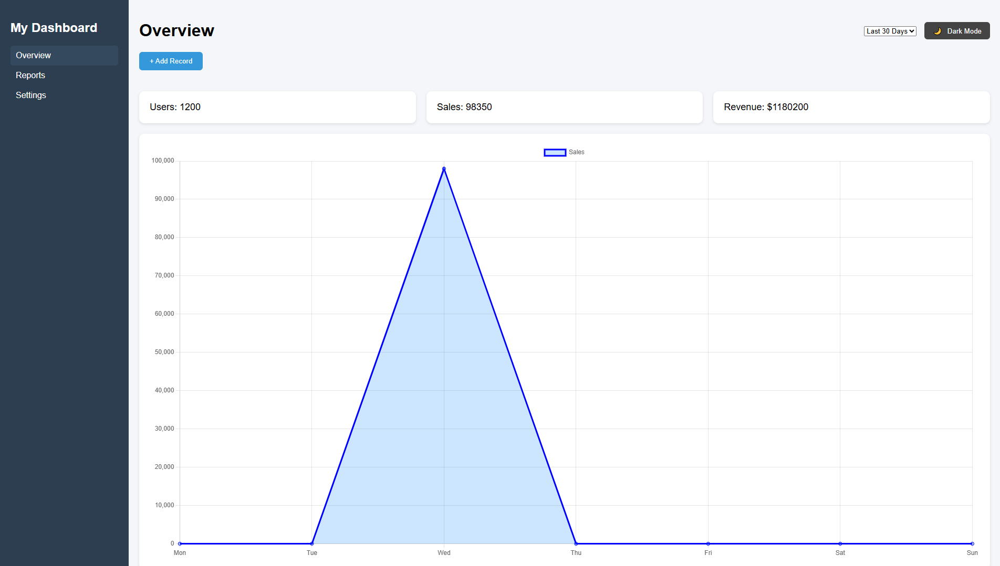
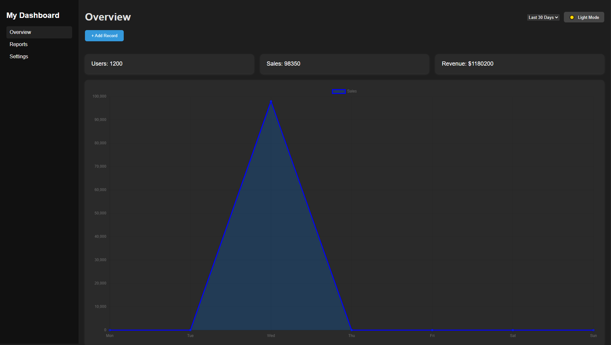

# 🌐 Interactive Dashboard UI

A responsive and interactive **Dashboard Web App** built with **HTML**, **CSS**, and **JavaScript** (using [Chart.js](https://www.chartjs.org/)).  
It features live data updates, light/dark themes, and smooth UI transitions — perfect for showcasing front-end development skills.

---

## ✨ Features

- 📊 **Overview Dashboard** with KPI cards and line chart  
- 📈 **Reports Page** with a bar chart showing monthly performance  
- ➕ **Modal Form** to add new sales data (updates chart + KPIs dynamically)  
- 🌙 **Dark / Light Mode** toggle with localStorage persistence  
- 📱 **Fully Responsive** layout with smooth transitions  

---

## 🧠 Tech Stack

| Category | Tools |
|-----------|--------|
| Frontend | HTML5, CSS3, Vanilla JavaScript |
| Charts & Data Viz | [Chart.js](https://www.chartjs.org/) |
| Design | Responsive Flexbox Layout |
| Hosting | [GitHub Pages](https://pages.github.com/) |

---

## 🚀 Live Demo  
👉 [View the Live Project](https://rockyromorosa.github.io/Interactive-Sales-Dashboard/)  


---

## 🖼️ Screenshots

### Light Mode  


### Dark Mode  


---

## 🧩 Installation & Local Setup

1. Clone this repository:
   ```bash
   git clone https://github.com/yourusername/interactive-dashboard-ui.git](https://github.com/rockyromorosa/Interactive-Sales-Dashboard


